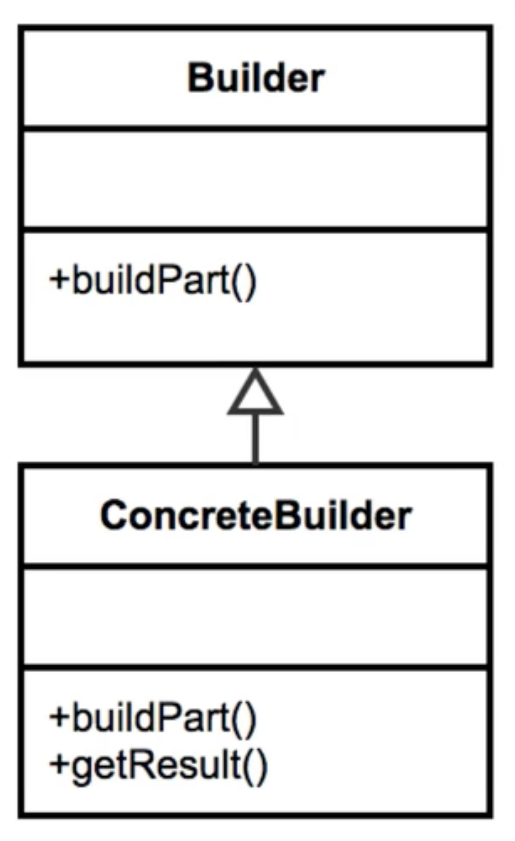
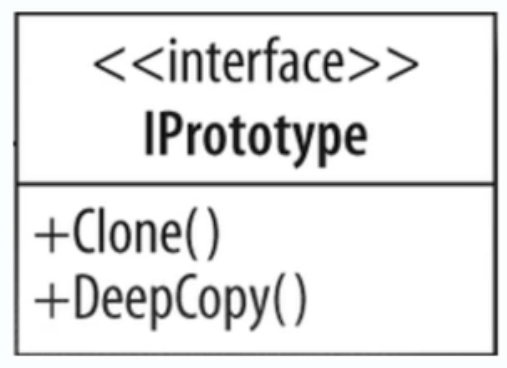

# Creational Design Patterns

Design Patterns are repeatable solutions to commonly occurring problems while developing. Beside providing standardised
and widely known solutions to these common problems, which favours maintainability, they also improve communication as it
provides a common vocabulary to approaches.

Important to remember that design patterns is an abstract topic therefore not something that you can memorise and go out
applying - there is no golden rule. Some patterns are more easily applied to some solution than others and learning which 
one to use comes with practice. With that in mind, it is important to revisit design patterns learning materials so that
you have as many of them as possible fresh in your mind to take the most out of it.

### Pattern Groups

Design patterns are classified in 3 groups by the gang of four:

- Creational
- Structural
- Behavioural

This repository will focus on explaining and demonstrating the creational ones. As the name implies, this group focuses
on how objects are created. The patterns explored will be:

- Singleton
- Builder
- Prototype
- Factory
- Abstract Factory


## Singleton

The concept behind this pattern is that it guarantees that only one instance is going to be crated for the whole application.
It also guarantees the control of a resource. 

Some examples where it is used by the java api and commonly used frameworks are: Runtime environment, 
logger (depending on the implementation) and spring beans. 

### Design

The singleton is responsible for creating itself and managing its lifecycle.

It is static in nature, but it is not implemented using a static class because it has to be thread-safe.

The inner implementation usually consists of:

1. A private variable that stores the singles instance
2. A private constructor that enables only the singleton itself to instantiate a new object
3. A public static method to ask for the instance

`Singletons usually do not take any parameters as it is a violation of the singleton principles.
Typically if you require parameters on the getInstance method you should mostly likely be using the factory pattern.`


Example of an everyday singleton usage:

```
Runtime singletonRuntime = Runtime.getRuntime();

singletonRuntime.gc();

System.out.println(singletonRuntime); // memory address

Runtime anotherSingletonRuntime = Runtime.getRuntime();

System.out.println(anotherSingletonRuntime); // memory address

if (singletonRuntime == anotherSingletonRuntime) {
    System.out.println("They are the same instance!!");
}
```

#### Singleton vs Factory

Singleton returns the same instance every time (thus it cannot take parameters in the getInstance method). 
Factory returns a new instance every time it is called.

Singleton has one constructor. Factory has multiple constructors and returns different types of objects.

Singleton has typically no interface. Factory is interface driven.


## Builder

This pattern is great for handling the construction of objects that may contain a lot of parameters and we want to make the object
immutable once we are done constructing it.

*It solves a very common problem in object-oriented programming that is determining what constructor to use. As 
often people create many constructors and it can become difficult to manage (known as telescoping constructors).*

When considering if the builder pattern makes sense or not for a given problem, the first thing to take into consideration
is if it handles a number of complex constructors with large number of parameters (or setters). 

Some examples from the java api for this pattern are: StringBuilder, DocumentBuilder and LocaleBuilder.

### Design

A builder is usually built with a static inner class that returns the instance of the wanted object. The builder calls the 
appropriate constructor based on its state.



Example of an everyday singleton usage:

```
StringBuilder builder = new StringBuilder();

builder.append("don");
builder.append("bob");
builder.append(123);

System.out.println(builder.toString());
```

#### Builder vs Prototype

Builder is designed to handle complex constructors while Prototype is implemented around a clone method.

Builder works well with legacy code (example StringBuilder) while Prototype is difficult to implement in legacy code.


## Prototype

This pattern is used when the type of object to be created is determined by a prototypical instance, which is cloned to 
produce a new instance. Many times, the prototype pattern is used to get a unique instance of the same object.

The concepts when choosing a prototype are when you are trying to avoid costly creation. However this pattern is not 
cut and dry as other patterns and in many instances it is only chosen when refactoring, not when people are thinking upfront.
Unlike singleton for instance, that you know you only want one instance, you wouldn't think of it in terms of being expensive
to create.

Prototypes also avoid subclassing and typically don't use the keyword new (the first instance might use it but after that
thet are cloned). 

An example from the java api: java.lang.Object#clone().

### Design 

At some extent the prototype pattern is a pattern that just changes the way that the new keyword is called. If an object is 
expensive to create but we can get what we need by copying the member variables, then the prototype is a great fit.

The prototype typically implements the Clone/Cloneable method and interface which enabled us to avoid the keyword `new`.

Although we are just essentially making a copy, each instance is still unique.

The clone could use parameters if needed but typically it doesn't. 

It is down to the developer to determine between shallow and deep copies. Shallow copies just copy the immediate properties 
whereas a deep copy will copy any of its object references as well.



Example of code:

```
public class Statement implements Cloneable {
    public Statemente(String sql, List<String> parameters, Record record) {
        this.sql = sql;
        this.paramenters = parameters;
        this.record = record;
    }

    public Statement clone() {
        try {
            return (Statement) super.clone();
        } catch (CloneNotSupportedException e) {
            return null;
        }
    }
}
```

ps: the cloneable interface was created in java 1.0 thus it is quite old and does not support generic. Creating
your own Cloneable interface and implementation wouldn't take long and would get rid of all the castings the Cloneable
interface imposes.

For the registry, there are many implementation options. The example here is the simplest one.

### Prototype vs Factory

Prototype focuses on lighter weight construction via copy constructor or clone method.  
Prototype allows a choice between shallow and deep copies.
Prototype only cares about a copy of itself (does not change the object type).

Factory allows multiple constructors and always provide a fresh instance (not a copy).