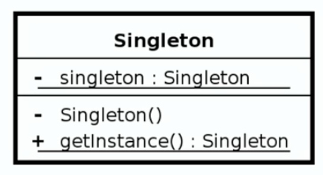

# Creational Design Patterns

Design Patterns are repeatable solutions to commonly occurring problems while developing. Beside providing standardised
and widely known solutions to these common problems, which favours maintainability, they also improve communication as it
provides a common vocabulary to approaches.

Important to remember that design patterns is an abstract topic therefore not something that you can memorise and go out
applying - there is no golden rule. Some patterns are more easily applied to some solution than others and learning which 
one to use comes with practice. With that in mind, it is important to revisit design patterns learning materials so that
you have as many of them as possible fresh in your mind to take the most out of it.

### Pattern Groups

Design patterns are classified in 3 groups by the gang of four:

- Creational
- Structural
- Behavioural

This repository will focus on explaining and demonstrating the creational ones. As the name implies, this group focuses
on how objects are created. The patterns explored will be:

- Singleton
- Builder
- Prototype
- Factory
- Abstract Factory


## Singleton

The concept behind this pattern is that it guarantees that only one instance is going to be crated for the whole application.
It also guarantees the control of a resource. 

Some examples where it is used by the java api and commonly used frameworks are: Runtime environment, 
logger (depending on the implementation) and spring beans. 

### Design

The singleton is responsible for creating itself and managing its lifecycle.

It is static in nature, but it is not implemented using a static class because it has to be thread-safe.

The inner implementation usually consists of:

1. A private variable that stores the singles instance
2. A private constructor that enables only the singleton itself to instantiate a new object
3. A public static method to ask for the instance

`Singletons usually do not take any parameters as it is a violation of the singleton principles.
Typically if you require parameters on the getInstance method you should mostly likely be using the factory pattern.`



Example of an everyday singleton usage:

```
Runtime singletonRuntime = Runtime.getRuntime();

singletonRuntime.gc();

System.out.println(singletonRuntime); // memory address

Runtime anotherSingletonRuntime = Runtime.getRuntime();

System.out.println(anotherSingletonRuntime); // memory address

if (singletonRuntime == anotherSingletonRuntime) {
    System.out.println("They are the same instance!!");
}
```

#### Singleton vs Factory

Singleton returns the same instance every time (thus it cannot take parameters in the getInstance method). 
Factory returns a new instance every time it is called.

Singleton has one constructor. Factory has multiple constructors and returns different types of objects.

Singleton has typically no interface. Factory is interface driven.


